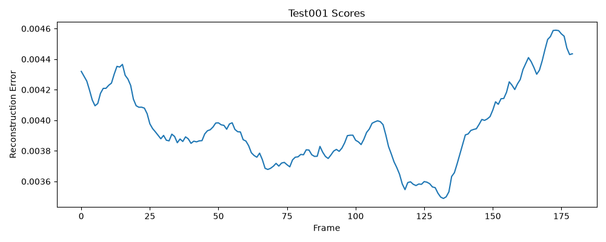
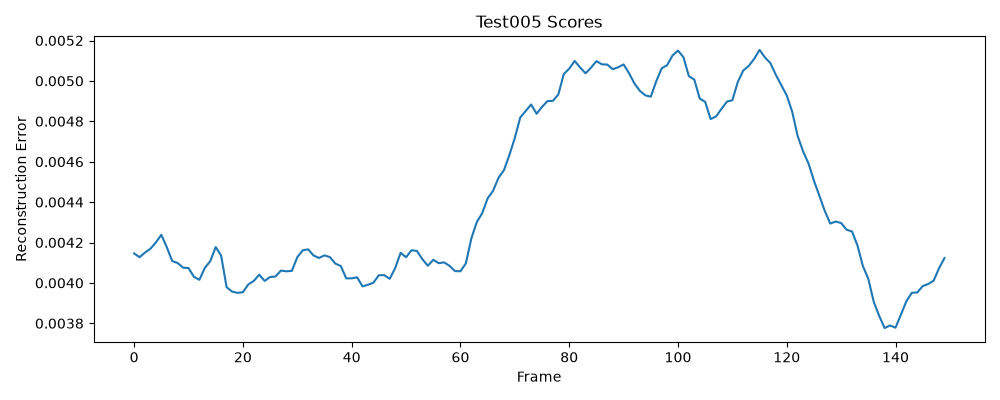
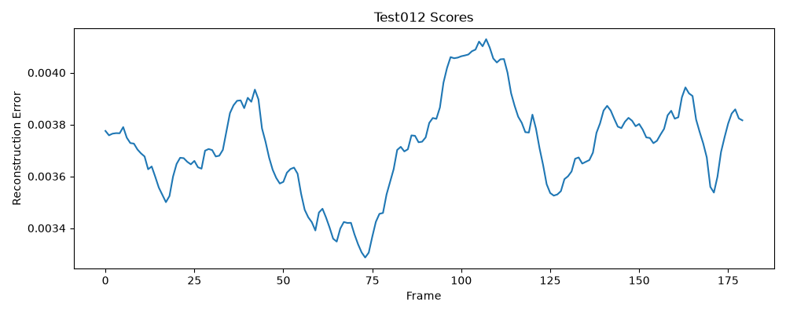

# MemAE Reproduction on UCSD Ped2

## Overview

This repository contains a simplified reproduction of the paper:

**Memorizing Normality to Detect Anomaly: Memory-Augmented Deep Autoencoder for Unsupervised Anomaly Detection**

Gong et al., ICCV 2019

The goal of this project is to reproduce the core idea of the Memory-Augmented Autoencoder (MemAE) and evaluate its anomaly detection performance on the UCSD Ped2 benchmark dataset.

Implemented components:

* Convolutional Autoencoder
* Memory-Augmented Latent Representation
* Reconstruction-based Anomaly Detection
* Frame-Level ROC AUC Evaluation
* Inference Speed Measurement (FPS)

---
# Preliminary Validation on MNIST

Before training on UCSD Ped2, the ConvMemAE implementation was validated using the MNIST dataset.

The MNIST experiments were used only to verify:

* encoder/decoder dimensions
* memory module functionality
* forward pass correctness
* reconstruction capability

MNIST was used exclusively for debugging and implementation validation.

The final reported anomaly detection results correspond only to the UCSD Ped2 dataset.

---

# Dataset

Dataset used:

**UCSD Ped2**

Expected structure:

```text
data/
└── UCSD_Anomaly_Dataset.v1p2/
    └── UCSDped2/
        ├── Train/
        │   ├── Train001
        │   ├── Train002
        │   └── ...
        │
        └── Test/
            ├── Test001
            ├── Test001_gt
            ├── Test002
            ├── Test002_gt
            └── ...
```

Training uses only normal frames from the Train split.

Ground-truth masks from the Test split are used only for evaluation.

---

# Environment

Python version:

```text
Python 3.12
```

Main dependencies:

```bash
pip install torch torchvision pillow scikit-learn matplotlib
```

---

# Model Architecture

## Encoder

```text
1×128×128
      ↓
Conv2d(1 → 32)
      ↓
ReLU
      ↓
Conv2d(32 → 64)
      ↓
ReLU
      ↓
Conv2d(64 → 128)
      ↓
ReLU
      ↓
Flatten
      ↓
Linear
      ↓
256-dimensional latent vector
```

## Memory Module

```text
Memory Size: 200
Feature Dimension: 256
```

The latent vector is matched against learnable memory slots using a softmax attention mechanism.

## Decoder

```text
Latent Vector
      ↓
Memory Reconstruction
      ↓
Linear
      ↓
128×16×16
      ↓
ConvTranspose2d
      ↓
ConvTranspose2d
      ↓
ConvTranspose2d
      ↓
1×128×128 Reconstruction
```

---

# Training

Run:

```bash
python train_ucsd.py
```

Training configuration:

| Parameter         | Value |
| ----------------- | ----: |
| Epochs            |    20 |
| Batch Size        |     8 |
| Learning Rate     |  1e-4 |
| Optimizer         |  Adam |
| Loss Function     |   MSE |
| Memory Size       |   200 |
| Feature Dimension |   256 |

The script automatically loads an existing checkpoint if available:

```text
conv_memae_ucsd.pth
```

and continues training from the saved state.

---

# Evaluation

Run:

```bash
python evaluate_uscd.py
```

The evaluation script:

* loads the trained model
* computes reconstruction errors
* generates anomaly scores
* computes frame-level ROC AUC
* computes per-video ROC AUC
* measures inference FPS
* saves anomaly score plots

Generated plots:

```text
Test001_scores.png
Test002_scores.png
...
Test012_scores.png
```

---

# Experimental Results

## Initial Reproduction Results

The first complete run produced:

| Metric          | Value |
| --------------- | ----: |
| Frame-Level AUC | 0.637 |
| FPS (CPU)       | 64.64 |

---

## Final Evaluation Results

After additional training and evaluation:

| Metric            |  Value |
| ----------------- | -----: |
| Frame-Level AUC   | 0.6372 |
| FPS (CPU)         |  67.36 |
| Training Epochs   |     20 |
| Memory Size       |    200 |
| Feature Dimension |    256 |

---

## Per-Video Results

| Test Sequence |    AUC |
| ------------- | -----: |
| Test001       | 0.3069 |
| Test002       | 1.0000 |
| Test003       | 0.9863 |
| Test004       | 1.0000 |
| Test005       | 0.8346 |
| Test006       | 0.8272 |
| Test007       | 1.0000 |
| Test008       |    N/A |
| Test009       |    N/A |
| Test010       |    N/A |
| Test011       |    N/A |
| Test012       | 0.8103 |

Test008–Test011 contain only a single class in the frame-level ground truth. Therefore ROC AUC is undefined and Scikit-Learn reports NaN.

---

# Comparison with Original MemAE

| Metric          | Original Paper | This Reproduction |
| --------------- | -------------: | ----------------: |
| Dataset         |      UCSD Ped2 |         UCSD Ped2 |
| Frame-Level AUC |          0.949 |            0.6372 |
| Inference FPS   |             38 |             67.36 |
| Memory Size     |           2000 |               200 |
| Training Epochs |            80+ |                20 |
| Device          |            GPU |               CPU |

The reproduced implementation follows the main MemAE concept but uses a simplified architecture.

Performance differences are expected because of:

* reduced memory size
* simplified network architecture
* absence of sparsity regularization
* absence of memory compactness loss
* CPU-only execution
* fewer training epochs
* partial corruption found in the downloaded UCSD Ped2 training set

Despite these limitations, the implementation successfully reproduces the MemAE workflow and demonstrates anomaly detection capability on UCSD Ped2.

---

# Reproducing the Results

To reproduce the experiments:

```bash
python dataset_test.py
python conv_test.py
python train_ucsd.py
python evaluate_uscd.py
```

Expected output:

```text
FRAME-LEVEL AUC ≈ 0.63
FPS ≈ 67
```

---

# Example Results

## Test001



## Test005



## Test012



---

# Reference

Gong, D., Liu, L., Le, V., Saha, B., Mansour, M. R., Venkatesh, S., & van den Hengel, A.

**Memorizing Normality to Detect Anomaly: Memory-Augmented Deep Autoencoder for Unsupervised Anomaly Detection**

Proceedings of the IEEE International Conference on Computer Vision (ICCV), 2019.
